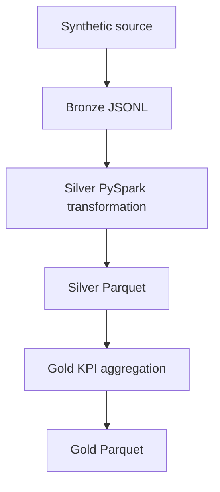

# Architecture and data contracts

## Processing flow

## Bronze contract

Bronze preserves the generated source record and adds `source` and `ingested_at` lineage fields. Snapshots are first written to a temporary file and atomically renamed, preventing partial input publication.

## Silver contract

Silver applies an explicit Spark schema, parses dates and timestamps, standardizes categorical values, and enforces core business rules. Duplicate property IDs are resolved by retaining the record with the latest ingestion timestamp. Derived fields include:

- `price_per_sqft`
- `property_age_at_sale`
- `sale_year`
- `sale_month`

Silver is stored as Parquet partitioned by `sale_year` and `state`.

## Gold contract

Gold contains annual city/state metrics:

- distinct properties sold
- total sales volume
- average and median sale price
- average price per square foot
- average property size
- minimum and maximum sale price

Gold uses the same year/state partition strategy, supporting efficient time- and geography-scoped reads.

## Reliability

- Deterministic seeded input supports reproducible tests.
- Explicit schemas prevent accidental type drift.
- Latest-record deduplication makes repeated source records predictable.
- Overwrite-mode local outputs make reruns idempotent for the same input set.
- Pipeline summaries expose row counts at each layer.
- Unit and local Spark integration tests run in CI.
